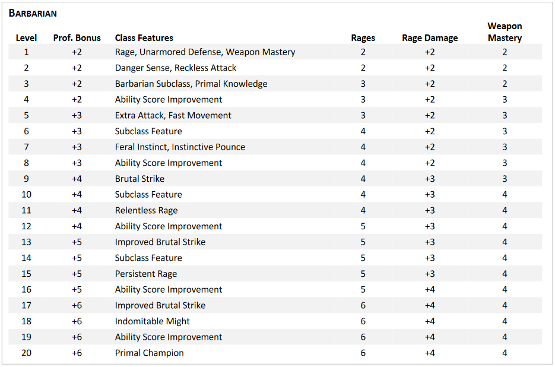

BARBARIAN
Primary Ability: Strength

Barbarians are warriors defined by their connection to the primal forces of the multiverse, which manifests as a Rage. Far more than a mere emotion, and not limited to anger or fury, a Barbarian’s Rage is an incarnation of a predator’s ferocity, a storm’s unrelenting assault, and the churning turmoil of the sea.

Some Barbarians personify their Rage as a fierce spirit or revered forebear. Others see it as a connection to the pain and anguish of the world, as an impersonal tangle of wild magic, or as an expression of their own deepest self. For every Barbarian, their Rage is a power that fuels not just battle prowess but also uncanny reflexes and heightened senses.

Some Barbarians are uncomfortable when hedged in by walls and crowds, preferring to live in regions of unspoiled natural vitality they cherish primal forces at work in farmlands. While others recognize the vitality and beauty of cities. Barbarians of all sorts embrace their own place in the multiverse, valuing keen instincts and raw physicality.

Even without the power of their Rage, Barbarians are skilled in combat and the use of weapons. When they do call on their Rage, it gives them superhuman strength and resilience. It also heightens their senses and reflexes, making the Rage useful beyond combat.

Barbarians often serve as protectors and leaders in their communities. They charge headlong into danger so those who are under their protection don’t have to. Their courage in the face of danger makes Barbarians perfectly suited for adventuring.

CREATING A BARBARIAN
To create a Barbarian, consult the following lists, which provide Hit Points, proficiencies, and armor training. If you’re making a level 1 character, also consult the “Starting Equipment” section, and if you’re using the multiclassing rules, see the “Multiclassing and the Barbarian” sidebar.

Then look at the Barbarian table to see the class features you get at each level in this class. Descriptions of those features appear in the “Barbarian Class Features” section.

HIT POINTS
Hit Dice: 1d12 per Barbarian level
Hit Points at Level 1: 12 + your Constitution modifier
Hit Points per Later Level: 1d12 (or 7) + your Constitution modifier per level
PROFICIENCIES
Saving Throws: Strength, Constitution
Skills (Choose 2): Animal Handling, Athletics, Intimidation, Nature, Perception, Survival
Weapons: Simple Weapons, Martial Weapons
Tools: None
ARMOR TRAINING
Light Armor, Medium Armor, Shields

STARTING EQUIPMENT
As a level 1 character, you start with the following equipment, or you can forgo it and spend 75 GP on equipment of your choice.

Explorer’s Pack
Greataxe
Handaxe (x4)
15 GP

MULTICLASSING AND THE BARBARIAN
If your group uses the multiclassing rules in the Player’s Handbook, here’s what you need to know if you choose Barbarian as one of your classes.

Ability Score Minimum. As a multiclass character, you must have a score of at least 13 in the Barbarian’s primary ability, Strength, to take a level in this class or to take a level in another class if you’re already a Barbarian.

Proficiencies Gained. If Barbarian isn’t your initial class, you gain proficiency with Martial Weapons when you take your first Barbarian level.

Armor Training. When you gain your first Barbarian level, you gain armor training with Shields.

BARBARIAN CLASS FEATURES
As a Barbarian, you gain the following class features when you reach the specified levels in this class. These features are listed on the Barbarian table.

LEVEL 1: RAGE
You can imbue yourself with a primal power that is called your Rage, a force that grants you extraordinary might and resilience. You can enter it as a Bonus Action, provided you aren’t wearing Heavy Armor. You can enter your Rage the number of times shown for your Barbarian level in the Rages column of the Barbarian table. You regain one expended use when you finish a Short Rest, and you regain all expended uses when you finish a Long Rest. While active, your Rage has the effects below:

Damage Resistance. You have Resistance to Bludgeoning, Piercing, and Slashing damage.
Rage Damage. When you make an attack using Strength - with either a weapon or an Unarmed Strike - and deal damage to the target, you gain a bonus to the damage that increases as you gain levels as a Barbarian, as shown in the Rage Damage column of the Barbarian table.
Strength Advantage. You have Advantage on Strength checks and Strength saving throws.
No Concentration or Spells. You can’t maintain Concentration, and you can’t cast spells.
Duration. The Rage lasts until the end of your next turn, and it ends early if you don Heavy Armor or have the Incapacitated condition. If your Rage is still active on your next turn, you can extend the Rage for another round by doing one of the following:
Make an attack roll against an enemy.
Force an enemy to make a saving throw.
Take a Bonus Action to extend your Rage
Each time the Rage is extended, it lasts until the end of your next turn. You can maintain a Rage for up to 10 minutes.

LEVEL 1: UNARMORED DEFENSE
While you aren’t wearing any armor, your base Armor Class equals 10 + your Dexterity and Constitution modifiers. You can use a Shield and still gain this benefit.

LEVEL 1: WEAPON MASTERY
Your training with weapons allows you to use the Mastery property of two kinds of Simple or Martial melee weapons of your choice, such as Greataxes and Handaxes. Whenever you finish a Long Rest, you can practice weapon drills and change one of those weapon choices. When you reach certain Barbarian levels, you gain the ability to use the Mastery properties of more kinds of weapons, as shown in the Weapon Mastery column of the Barbarian table.

LEVEL 2: DANGER SENSE
You gain an uncanny sense of when things aren’t as they should be, giving you an edge when you dodge perils. You have Advantage on Dexterity saving throws, provided you don’t have the Incapacitated condition.

LEVEL 2: RECKLESS ATTACK
You can throw aside all concern for defense to attack with fierce ferocity. When you make your first attack roll on your turn, you can decide to attack recklessly. Doing so gives you Advantage on attack rolls using Strength until the start of your next turn, but attack rolls against you have Advantage during that time.

LEVEL 3: BARBARIAN SUBCLASS
You gain a Barbarian subclass of your choice:

Path of the Berserker
Path of the Wild Heart
Path of the World Tree
Path of the Zealot
Path of the Ancestral Guardian (Non-Playtest)
Path of the Beast (Non-Playtest)
Path of the Storm Herald (Non-Playtest)
Path of Wild Magic (Non-Playtest)
Subclasses are detailed after this class’s description. A subclass is a specialization that grants you special features at certain Barbarian levels. For the rest of your career, you gain each of your subclass’s features that are of your Barbarian level and lower. There are non-playtest subclasses that can be used, please check with your DM before using one.

LEVEL 3: PRIMAL KNOWLEDGE
You gain proficiency in another skill of your choice from the list of skills available to Barbarians at level 1. In addition, while your Rage is active, you can channel primal power when you attempt certain tasks; whenever you make an ability check using one of the following skills, you can make it as a Strength check even if it normally uses a different ability: Acrobatics, Intimidation, Perception, Stealth, or Survival. When you use this ability, your Strength represents primal power coursing through you, honing your agility, bearing and senses.

LEVEL 4: ABILITY SCORE IMPROVEMENT
You gain the Ability Score Improvement feat or another feat of your choice for which you qualify. As shown on the Barbarian table, you gain this feature again at levels 8, 12, 16.

LEVEL 5: EXTRA ATTACK
You can attack twice, instead of once, whenever you take the Attack action on your turn.

LEVEL 5: FAST MOVEMENT
Your speed increases by 10 feet while you aren’t wearing Heavy Armor.

LEVEL 7: FERAL INSTINCT
Your instincts are so honed that you have Advantage on Initiative rolls.

LEVEL 7: INSTINCTIVE POUNCE
As part of the Bonus Action you take to enter your Rage, you can move up to half your Speed.

LEVEL 9: BRUTAL STRIKE
If you use Reckless Attack, you can forgo Advantage on one Strength-based attack roll of your choice on your turn. The chosen attack roll mustn't have Disadvantage. If the chosen attack hits, the target takes an extra 1d10 damage of the same type dealt by the weapon or Unarmed Strike, and you can cause one Brutal Strike effect of your choice. You have the following effect options:

Forceful Blow. The target is pushed 15 feet straight away from you. You can then move up to half your Speed straight toward the target without provoking Opportunity Attacks.
Hamstring Blow. The target’s Speed is reduced by 15 feet until the start of your next turn. A target is only affected by the most recent Hamstring blow

LEVEL 11: RELENTLESS RAGE
Your Rage can keep you fighting despite grievous wounds. If you drop to 0 Hit Points while your Rage is active and don’t die outright, you can make a DC 10 Constitution saving throw. If you succeed, your Hit Points instead change to a number equal to twice your Barbarian level. Each time you use this feature after the first, the DC increases by 5. When you finish a Short Rest or Long Rest, the DC resets to 10.

LEVEL 13: IMPROVED BRUTAL STRIKE
You have honed new ways to attack furiously. The following effects are now among your Brutal Strike options:

Staggering Blow. The target has Disadvantage on the next saving throw it makes, and it can’t make Opportunity Attacks until the start of your next turn.
Sundering Blow. Before the start of your next turn, the next attack roll made by another creature against the target gains a +5 bonus to that roll. An attack roll can gain only one Sundering Blow bonus.
LEVEL 15: PERSISTENT RAGE
When you roll Initiative, you can regain all expended uses of Rage. After you regain uses of Rage in this way, you can’t do so again until you finish a Long Rest. In addition, your Rage is so fierce that it now lasts for 10 minutes without you needing to do anything to extend it from round to round. The Rage ends early if you have the Unconscious condition (not the Incapacitated condition) or don Heavy Armor

LEVEL 17: BRUTAL STRIKE IMPROVEMENT
The extra damage your Brutal Strike deals increases to 2d10. In addition, you can use two different Brutal Strike effects when you use this feature.

LEVEL 18: INDOMITABLE MIGHT
If your total for a Strength check or Strength saving throw is less than your Strength score, you can use that score in place of the total.

LEVEL 19: EPIC BOON
You gain an Epic Boon feat or another feat of your choice for which you qualify. Boon of Irresistible Offense is recommended.

LEVEL 20: PRIMAL CHAMPION
You embody primal power. Your Strength and Constitution scores increase by 4, and their maximum is now 25.