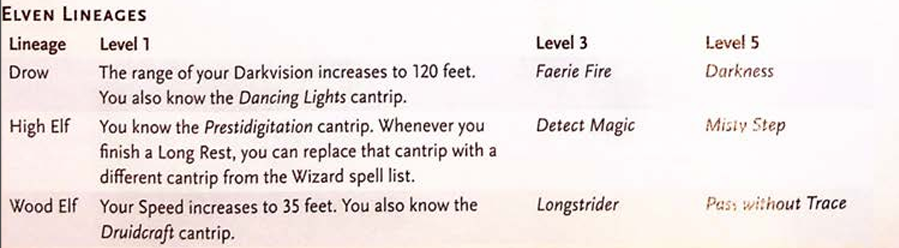

ELF 
Created by the god Corellon, the first elves could 
change their forms at will. They lost this ability 
when Corellon cursed them for plotting with the 
deity Lolth, who tried and failed to usurp Corellon's 
dominion. When Lolth was cast into the Abyss, 
most elves renounced her and earned Corellon's for
giveness, but that which Corellon had taken from 
them was lost forever. 
No longer able to shape-shift at will, the elves 
retreated to the Feywild, where their sorrow was 
deepened by that plane's influence. Over time, cu
riosity led many of them to explore other planes of 
existence, including worlds in the Material Plane. 
Elves have pointed ears and lack facial and body 
hair. They live for around 750 years, and they don't 
sleep but instead enter a trance when they need to 
rest. In that state, they remain aware of their sur
roundings while immersing themselves in memories 
and meditations. 
An environment subtly transforms elves after 
they inhabit it for a millennium or more, and it 
grants them certain kinds of magic. Drow, high 
elves, and wood elves are examples of elves who 
have been transformed thus. 
DROW 
Drow typically dwell in the Underdark and have 
been shaped by it. Some drow individuals and soci
eties avoid the Underdark altogether yet carry its 
magic. In the Eberron setting, for example, drow 
dwell in rainforests and cyclopean ruins on the con
tinent of Xen'drik. 
HIGH ELVES 
High elves have been infused with the magic of 
crossings between the FeY'vild and the Material 
Plane. On some worlds, high elves refer to them
selves by other names. For example, they call them
selves sun or moon elves in the Forgotten Realms 
setting, Silvanesti and Qualinesti in the Dragon
lance setting, and Aereni in the Eberron setting. 
Woon ELVES 
Wood elves carry the magic of primeval forests 
within themselves. They are known by many other 
names, including wild elves, green elves, and forest 
elves. Grugach are reclusive wood elves of the Grey
hawk setting, while the Kagonesti and the Tairnadal 
are wood elves of the Dragonlance and Eberron set
tings, respectively. 
189 
CHAPTER 4 I CHARACTER ORIGINS 
ELF TRAITS 
Creature Type: Humanoid 
Size: Medium (about 5-6 feet tall) 
Speed: 30 feet 
As an Elf, you have these special traits. 
Darkvision. You have Darkvision with a range of 
60 feet. 
Elven Lineage. You are part of a lineage that 
grants you supernatural abilities. Choose a lineage 
from the Elven Lineages table. You gain the level 1 
benefit of that lineage. 
When you reach character levels 3 and S, you 
learn a higher-level spell, as shown on the table. 
You always have that spell prepared. You can cast it 
ELVEN LINEAGES 
Lineage 
Drow 
High Elf 
Level 1 
once without a spell slot, and you regain the ability 
to cast it in that way when you finish a Long Rest. 
You can also cast the spell using any spell slots you 
have of the appropriate level. 
Intelligence, Wisdom, or Charisma is your spell
casting ability for the spells you cast with this trait 
(choose the ability when you select the lineage). 
Fey Ancestry. You have Advantage on saving 
throws you make to avoid or end the Charmed 
condition. 
Keen Senses. You have proficiency in the Insight, 
Perception, or Survival skill. 
Trance. You don't need to sleep, and magic can't 
put you to sleep. You can finish a Long Rest in 4 
hours if you spend those hours in a trancelike medi
tation, during which you retain consciousness. 
Level 3 
The range of your Darkvision increases to 120 feet. 
You also know the Dancing Lights cantrip. 
You know the Prestidigitation cantrip. Whenever you 
finish a Long Rest, you can replace that cantrip with a 
different cantrip from the Wizard spell list. 
Wood Elf Your Speed increases to 35 feet. You also know the 
Druidcraft cantrip. 
J90 
Faerie Fire 
Detect Magic 
Level 5 
Darkness 
Mi:;iv Step 
Pus: :,;i:hout Trace 
