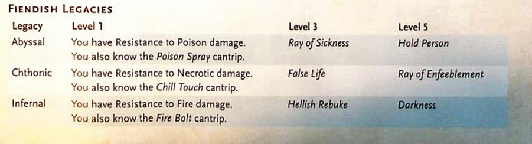

TIEFLING 
Tieflings are either born in the Lower Planes or 
have fiendish ancestors who originated there. A 
tiefling (pronounced TEE-fling) is linked by blood 
to a devil, a demon, or some other Fiend. This con
nection to the Lower Planes is the tiefling's fiendish 
legacy, which comes with the promise of power yet 
has no effect on the tiefling's moral outlook. 
A tiefling chooses whether to embrace or lament 
their fiendish legacy. The three legacies are de
scribed below. 
ABYSSAL 
The entropy of the Abyss, the chaos of Pandemo
nium, and the despair of Carceri call to tieflings 
who have the abyssal legacy. Horns, fur, tusks, and 
peculiar scents are common physical features of 
such tieflings, most of whom have the blood of de
mons coursing through their veins. 
CHTHONIC 
Tieflings who have the chthonic legacy feel not only 
the tug of Carceri but also the greed of Gehenna 
and the gloom of Hades. Some of these tieflings look 
cadaverous. Others possess the unearthly beauty 
of a succubus, or they have physical features in 
common with a night hag, a yugoloth, or some other 
Neutral Evil fiendish ancestor. 
INFERNAL 
The infernal legacy connects tieflings not only to 
Gehenna but also the Nine Hells and the raging 
battlefields of Acheron. Horns, spioes, tails, golden 
eyes, and a faint odor of sulfur or smoke are com
mon physical features of such tiefli, gs, most of 
whom trace their ancestry to de-,.,i: • .. 
TIEFLING TRAITS 
Creature Type: Humanoid 
Size: Medium (about 4-7 feet tall) or Small (about 
3-4 feet tall), chosen when you select this species 
Speed: 30 feet 
As a Tiefling, you have the following special traits. 
Darkvision. You have Darkvision with a range of 
60 feet. 
Fiendish Legacy. You are the recipient of a legacy 
that grants you supernatural abilities. Choose a leg
acy from the Fiendish Legacies table. You gain the 
level 1 benefit of the chosen legacy. 
When you reach character levels 3 and 5, you 
learn a higher-level spell, as shown on the table. 
You always have that spell prepared. You can cast it 
once without a spell slot, and you regain the ability 
to cast it in that way when you finish a Long Rest. 
You can also cast the spell using any spell slots you 
have of the appropriate level. 
Intelligence, Wisdom, or Charisma is your spell
casting ability for the spells you cast with this trait 
(choose the ability when you select the legacy). 
Otherworldly Presence. You know the Thauma
turgy cantrip. When you cast it with this trait, the 
spell uses the same spellcasting ability you use for 
your Fiendish Legacy trait. 
